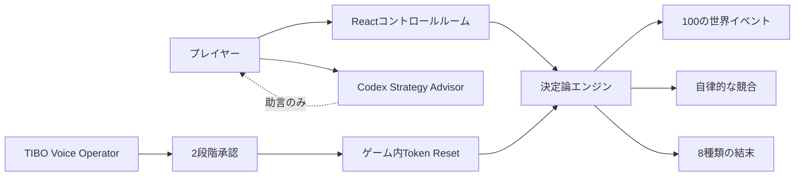

# Codex 2040

<p align="center">
  <strong>アクセス、能力、安全性、信頼、競争が未来を変える、プレイ可能なAIガバナンス・シミュレーション。</strong>
</p>

<p align="center">
  <a href="README.md">English</a> ·
  <a href="https://codex-2040.kai-postv.chatgpt.site/">最新版をプレイ</a> ·
  <a href="https://youtu.be/G1lsFJ5DhCE">デモを見る</a> ·
  <a href="https://devpost.com/software/codex-2040-td74xu">Devpostプロジェクト</a>
</p>

> 🥉 **OpenAI Build Week Tokyo コミュニティイベント 3位（2026年）。** 東京会場でのローカル受賞であり、グローバルDevpostコンペとは別の実績です。[イベントページ](https://luma.com/9ksxm746)

[](https://codex-2040.kai-postv.chatgpt.site/)

| 時間軸 | 世界 | 戦略 | 圧力 | 結末 |
| --- | --- | --- | --- | --- |
| **2026 → 2040** | **8地域** | **50ノード** | **100イベント** | **8種類** |

プレイヤーは2026年から2040年までCodexを運営します。便利なAIへのアクセスを広げるだけでは勝てません。能力が安全性を追い越し、規制が展開を止め、待っている間にも競合は動き、独占による成功が最悪の結末へ反転することがあります。

> 世界を所有したのではない。世界が学ぶのを助けたのだ。

## トレードオフを見て選ぶ

<p align="center">
  
  
</p>

<p align="center"><sub>提供されたBuild Week録画から選んだフレームです。現在のUIはホスト版を正とします。</sub></p>

戦略画面では、前提条件、コスト、効果、取り消せない排他関係を実行前に確認できます。カタログは **Model 12個**、**Product 16個**、**Company 12個**、**Open Ecosystem 10個**の計50ノードです。

## ゲームループ

1. **投資する** — 限られたComputeを能力、製品、組織の制御力、オープンなエコシステムへ配分します。
2. **時間を進める** — Normal / Fastで進行します。放置中も競合の投資と運用費は止まりません。
3. **応答する** — 100の世界イベントと2029年・2035年の決断に対応します。重大イベントでは時間が停止します。
4. **自分の世界線を振り返る** — アクセス、Trust、市場の健全性、安全性、統治、8種類の結末で評価します。

| 選択 | 見える変化 | 放置した場合 |
| --- | --- | --- |
| 能力を伸ばす | 強い製品と速い普及 | 能力と安全性・統治の差から事故、Misalignment、Regulatory Freezeが起こり得る |
| 地域・製品を広げる | 有益なAIアクセスが増え、Momentumが再開 | Computeが減り、未展開地域を競合に取られる |
| エコシステムを開く | Codexシェアを譲る代わりにTrustと市場の健全性を改善 | 市場集中がPyrrhic Monopolyにつながる |
| 安全性と統治を強くする | 制御圧力が下がり、回復力が上がる | 能力競争の速度を失う可能性がある |

評価は地域カバレッジ、有益なアクセス、健全な競争、安全性を重視します。単一の数字だけを最大化しても勝てない設計です。

## Codex 2040の3つの特徴

### 決定論エンジンと読める因果

seed付きTypeScriptエンジンが、すべての数値、リスク遷移、結末を管理します。1日単位の固定ステップ、自律的な競合戦略、状態境界、自動保存、再現可能な結果を実装しています。世界イベントは災害、文化、政策、競争、技術の5カテゴリに各20件あり、出典、クールダウン、事前行動とのコンボを持ちます。

### 読み取り専用のCodex Strategy Advisor

ブラウザでゲームを動かし、その横のCodexへ相談して遊ぶ設計です。Advisorは自然言語の意図を現在選べるノードへ対応づけ、コスト・効果・トレードオフを説明して操作を返します。クリック、イベント注入、セーブ変更、代理プレイは行いません。

### 明示承認つきRealtime Voice

**TIBO — ボイス・オペレーター** は、OpenAI Agents SDK、`RealtimeAgent`、`RealtimeSession`、`gpt-realtime-2.1`、WebRTC、2段階承認を使います。できるのはゲーム内TIBO Token Resetの要求と、音声での明示承認後に1回実行することだけです。OpenAIアカウント、請求、API上限、権限は変更できません。



## プレイする

最新版は **[codex-2040.kai-postv.chatgpt.site](https://codex-2040.kai-postv.chatgpt.site/)** で公開しています。アカウントは不要です。4ステップのチュートリアルが使命と敗北条件を説明し、再訪時はブラウザの自動保存から再開します。

公開版には、決定論ゲーム、戦略ツリー、自律的な競合、世界イベント、決断、テレメトリ、結末が含まれます。音声機能だけは環境で異なります。

| 環境 | ゲーム | TIBO音声 |
| --- | --- | --- |
| OpenAI Sites公開版 | 決定論シミュレーション全体 | 明示表示された台本フォールバック |
| `OPENAI_API_KEY`を持つローカルViteサーバー | 決定論シミュレーション全体 | 承認つきツールを使うRealtime WebRTCセッション |

標準APIキーはサーバー側だけで扱い、静的クライアントバンドルには含めません。

## ローカル起動

必要環境はNode.js `^20.19.0`または`>=22.12.0`とnpmです。

```bash
npm ci
npm run dev
```

`http://127.0.0.1:5173` を開いてください。Realtime Voiceを使う場合は、Git管理対象外の `.env.local` に `OPENAI_API_KEY` を置きます。キーがなければ台本フォールバックへ自動的に切り替わります。

全自動検証は次の1コマンドです。

```bash
npm run check
```

`npm run check` はVitest、TypeScript検査、Viteクライアントビルド、Workerビルドを実行します。ブラウザE2Eは別のリリースゲートです。

## アーキテクチャ

- `src/engine.ts` — 固定ステップ遷移、行動効果、事故、状態境界、採点、結末。
- `src/strategyNodes/` — 検証済みの英日50ノード、前提、排他、コスト、効果。
- `src/worldEvents/` — 5カテゴリのイベント、発生条件、コンボ、決定論スケジューラ。
- `src/rivalStrategy.ts` — 自律的な競合戦略と可視化された競争圧力。
- `src/components/` — 世界地図、戦略ツリー、決断、音声、イベント、結末UI。
- `.agents/skills/codex-2040-advisor/` — 相談だけを行うAdvisorの境界。
- `server/realtimePlugin.js` と `src/voiceAgent.ts` — 短命Realtime client secretとブラウザ音声セッション。
- `worker/`、`server/runsApi.ts`、`db/` — 公開ランタイム、実行テレメトリ、D1永続化。

以前のGMファイルブリッジは休眠中の実験・テスト資料として残しています。通常プレイではheartbeat、polling、fallback deck、action transportを開始しません。

## CodexとGPT-5.6での開発

Codexは開発環境であると同時に、エンジニアリングの協働者でした。学習テーマの決定論的状態機械への変換、調査と実装の並列化、Reactコントロールルームと音声フロー、敵対的な再現・バランステスト、ローカライズ、ソースと実ブラウザに基づく公開主張の監査に使いました。

GPT-5.6はアイデア出しだけでなく、仕様、エンジン、UI、テスト、プレイテスト証拠、ドキュメントを横断する中核開発で継続的に使っています。

## 教育的な出典

各シナリオ項目は出典を明示します。

- **AI 2027** — 能力、競争、減速のダイナミクスを教育用に翻案。
- **AI 2040** — Plan Aのガバナンスと協調の考え方を教育用に翻案。
- **Your Timeline** — プレイヤーの選択から生まれた結果。

Codex 2040は、AI Futures Projectの [AI 2027](https://ai-2027.com/) と [AI 2040: Plan A](https://ai-2040.com/) に着想を得た独立した教育用翻案です。両シナリオを予測として提示せず、学習のために単純化・再構成しています。原著者との提携・推薦関係はありません。

## 制約

- 信頼できるRealtimeバックエンドがない公開静的ビルドでは、音声は台本フォールバックです。
- ブラウザE2E、実マイクでのリハーサル、公開originの確認は、unit/build成功とは別のリリース確認です。
- このシミュレーションは教育用の単純化であり、予測や政策提言ではありません。

## Build Week初期版の記録

[](docs/assets/codex-2040-demo.mp4)

**[▶ 初期プロトタイプの12秒動画](docs/assets/codex-2040-demo.mp4)** または **[現在のナレーションつきデモ](https://youtu.be/G1lsFJ5DhCE)** を見ることができます。
