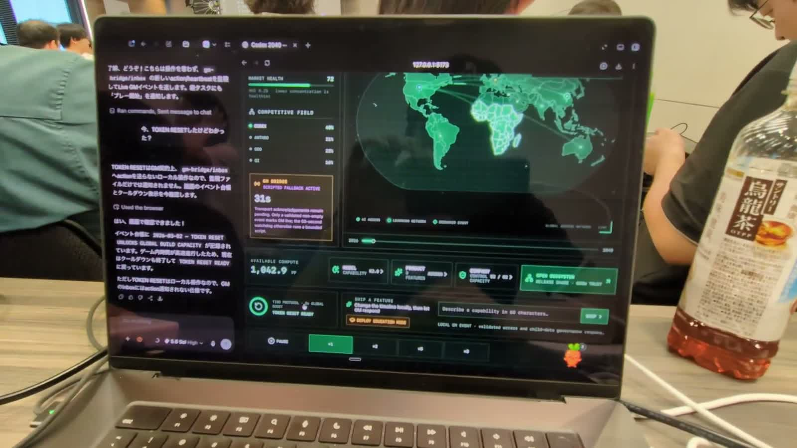

# Codex 2040

**Codex 2040 is an educational AI-governance simulation about expanding access without outrunning safety, governance, or healthy competition.**

The product thesis is simple: Codex helps build a game about its own spread, then becomes the player's strategy advisor. In the Codex app experience, the left surface explains tradeoffs while the right in-app browser runs the deterministic simulation. The player is the only operator. The goal is not to own the world, but to help it adopt useful AI while preserving trust and a plural ecosystem.

> You did not own the world. You helped it learn.

## Demo

[](docs/assets/codex-2040-demo.mp4)

**[▶ Watch the 12-second Codex 2040 demo](docs/assets/codex-2040-demo.mp4)** — the Codex advisor and browser simulation running together during Build Week Tokyo.

## Why Education

Long-form AI scenarios ask readers to mentally connect capability progress, access, safety, regulation, trust, and concentration. Codex 2040 turns those relationships into actions with visible consequences:

- Invest in capability, then watch safety and governance gaps widen if the organization does not keep up.
- Ship features and expand communities while tracking who receives access.
- Choose between racing, slowing down, and verifiable coordination at pivotal moments.
- Open the ecosystem to give up share, reduce concentration, and rebuild trust.
- Reach 2040 and review how the player's timeline diverged from the reference scenarios.

The score rewards coverage, beneficial access, healthy competition, and safety equally. High adoption through monopoly or unsafe acceleration is therefore not the best ending.

## What Is Implemented

The integrated browser experience includes:

- An interactive geographic world map with eight simulation regions and event markers.
- A competitor territory view: selecting ANTHRO, GOO, or QI recolors the map by estimated regional share and opens a strategy dossier.
- A deterministic seeded engine using fixed one-day steps with a Plague Inc.-style Normal / Fast Forward control (1 or 8 substeps per frame).
- Logistic adoption, competitor dynamics, regulation, incidents, brownout recovery, and bounded invariants.
- Model, Product, Safety Team, Policy, and Data Center investments funded by Compute.
- Curated product actions and a strategy tree; arbitrary feature text is not accepted inside the game.
- Community deployments, an eight-second Token Reset boost, and an Open Ecosystem action.
- A deterministic catalog of 100 authored world events: 20 each for disasters, culture, policy, competition, and technology.
- Weighted date-key scheduling with global/category cooldowns, one-time event history, and an independent random stream that cannot perturb incidents.
- Twenty-five major popup candidates, automatically rate-limited and downgraded to the news ticker when another interruption would be too frequent.
- Feature/event combos that recognize prior player actions, add bounded secondary effects, and can award at most 30 days of Momentum.
- Three active provenance labels rendered from engine metadata: **AI 2027**, **AI 2040**, and **Your Timeline**.
- A read-only Codex Advisor Skill that translates freeform intentions into available game actions without clicking, injecting events, or running a heartbeat.
- Autonomous rivals that continue investing and competing while the player waits, creating a credible passive-loss path rather than guaranteed growth.
- An exact bilingual 50-node strategy catalog (12 Model, 16 Product, 12 Company, and 10 Open Ecosystem nodes), with prerequisites, exclusions, costs, effects, and catalog validation. Its full engine/UI integration is still being verified on this development branch and should not be presented as submission-complete until `npm run check` is green.
- Required 2029 and 2035 decisions whose choices change engine state and endings.
- Eight resolved outcomes: Beneficial Abundance, Managed Transition, Fragile Abundance, Race Future, Regulatory Freeze, Safety Incident, Misalignment, and Pyrrhic Monopoly.
- A three-decision ending review comparing the reference scenarios with the player's timeline.
- A first-run mission screen and four-step playable tutorial. Returning sessions resume from browser autosave without replaying either screen.
- Subtle, optional CC0 interaction audio for navigation, actions, time controls, world briefs, and critical alerts, with an always-visible mute control.
- A Momentum loop: player interventions unlock bounded growth windows; waiting stalls access while operating costs and competitors continue.
- Automatic pause-and-brief behavior for critical events, with visible Trust causes and every major game-over route.
- An official OpenAI Voice Agent (`RealtimeAgent` + `RealtimeSession`) over browser WebRTC for **TIBO — Voice Operator**, explicitly identified as a fictionalized operator using a generic synthetic voice.
- A two-call `trigger_token_reset` function-tool contract: the first call creates a visible pending request, and a second call can invoke the existing in-game reset only after a separate explicit spoken confirmation.
- A same-UI scripted voice fallback for missing credentials, microphone denial, or Realtime failure.
- Automated tests covering the engine, 100-event catalog, deterministic scheduling, popup integration, the dormant bridge contract, scenario data, branches, and endings.

## Architecture and Advisor Boundary

- `src/engine.ts` owns state, fixed-step transitions, action effects, incidents, invariants, provenance-bearing news, scoring, and ending evaluation.
- `src/worldEvents/` owns the five-category catalog, schema validation, eligibility rules, combos, and the date-key deterministic scheduler.
- `.agents/skills/codex-2040-advisor/SKILL.md` defines the consultation-only contract and maps freeform product intentions to player-executed UI actions.
- `src/strategyNodes/` defines and validates the bilingual 50-node catalog while `src/components/UpgradeOverlay.tsx` renders the strategy surface.
- `src/gm.ts`, `src/gmBridgeClient.ts`, and `server/gmBridgePlugin.js` preserve the earlier bounded bridge experiment for tests and reference, but normal gameplay does not start its heartbeat, polling loop, fallback deck, or action transport.
- `server/realtimePlugin.js` uses the standard OpenAI API key only on the Vite server to mint a 120-second Realtime client secret. Upstream failures collapse to a non-sensitive fallback response.
- `src/voiceAgent.ts` constructs the official OpenAI Agents SDK `RealtimeAgent` and `RealtimeSession`, pins `gpt-realtime-2.1` with the `webrtc` transport, and owns audio, subtitles, mute, lifecycle, and the function tool.
- `src/voiceReset.ts` validates both `trigger_token_reset` calls, owns the visible approval state, rejects mismatched or duplicate confirmations, and respects the engine cooldown before allowing one game action.
- `src/components/VoiceCallPanel.tsx` renders the operator identity, game-only scope, call state, microphone state, subtitles, fallback, keyboard hints, and approval controls.
- `src/scenario.ts` is the canonical source for provenance metadata, milestones, 2029/2035 choices, and core outcome definitions.
- `src/App.tsx` coordinates the browser runtime, tutorial, local actions, Momentum feedback, authored-event pauses, decisions, and ending review.
- `src/components/` contains the map, strategy tree, decision, and ending interfaces.

### Advisor and world-event flow

1. The player may tell the Codex Advisor what they want to build or protect.
2. The Advisor consults its Skill, names an available action, explains cost/effect/tradeoff, and returns control. It never clicks or modifies state.
3. The player performs the action in the browser. Local effects apply immediately through the deterministic engine.
4. Independently, the engine checks the authored event catalog using the run seed and simulated date. Eligible events respect date windows, requirements, and cooldowns.
5. Events apply only bounded user/share/growth/Trust effects. They cannot write Compute, Capability, Safety, Governance, decisions, incidents, or endings.
6. Major events pause the browser simulation until acknowledgement; smaller events enter the ticker and Event Ledger without interruption.

The authority boundary is strict: the engine owns every number, risk transition, and ending; the player owns every action; the Advisor owns explanation only. Freeform feature creation has deliberately been removed from the browser game. Players discuss an idea with the Advisor, then choose one of the deterministic actions that the game exposes.

## Run Locally

Requirements:

- Node.js `^20.19.0` or `>=22.12.0`
- npm

Install the locked dependency set and start the Vite development server:

```bash
npm ci
npm run dev
```

Open `http://127.0.0.1:5173` in the Codex app browser.

For live Realtime voice, place `OPENAI_API_KEY` in the ignored local `.env.local`. Vite loads it only into the server configuration; it is not exposed through `import.meta.env` or the client bundle. If the key is absent, invalid, or lacks Realtime access, the call panel automatically uses scripted voice fallback.

When exposing the development server through a public HTTPS tunnel, also set `PUBLIC_DEMO_ORIGIN` to that tunnel's exact origin. The Realtime client-secret endpoint continues to reject every other non-loopback origin.

Run verification with:

```bash
npm run check
```

Or run the stages separately:

```bash
npm test
npm run build
```

Do not treat a passing test stage as a complete release check: `npm run check` must finish both Vitest and the TypeScript/Vite production build. The current 50-node integration passes 140 tests and the production build; browser E2E remains a separate release gate.

## Static Hosting and OpenAI Sites

The deterministic game is a Vite single-page application and can be published as a static site. OpenAI Sites is the recommended judging URL because it is stable and does not depend on a laptop or temporary tunnel. A site has **not** been created yet, so this README intentionally contains no public deployment URL.

A static deployment includes the complete game, tutorial, autosave, strategy controls, autonomous rivals, authored events, decisions, and endings. It does not include Vite development-server routes:

- `/api/realtime/client-secret` is local-server-only, so a static site uses the clearly labelled scripted voice fallback rather than claiming a live Realtime connection.
- The dormant GM file bridge is also development-server-only and is not required for normal play.

Build and inspect the static artifact locally before publishing:

```bash
npm ci
npm run build
npm run preview
```

For a live OpenAI Realtime Voice Agent demo, use the local development server with a server-held `OPENAI_API_KEY`, or add an equivalent trusted backend before claiming Realtime support on a hosted origin. Never place the standard API key in the static bundle.

## Realtime Voice Demo

1. Complete the four-step tutorial and begin the Normal simulation.
2. Open **VOICE OPERATOR**, then select **START CALL**. The browser asks for microphone access only after this explicit action.
3. Ask: **「ゲーム内Tiboトークンのリミットをリセットして」**.
4. The Voice Agent calls `trigger_token_reset` with `confirmed: false`; the game shows the pending tool request but does not execute it.
5. The agent asks for confirmation aloud. A short direct reply such as **「やって！」**, **「お願い」**, **“Do it!”**, or **“Go ahead”** is enough. It then makes a second tool call with the matching approval ID and spoken confirmation; the existing engine reset runs once and the map emits its global pulse. No UI confirmation is required on this normal path.
6. Use **MUTE**, **END CALL**, or the keyboard controls shown in the panel as needed. If the key, microphone, or Realtime connection is unavailable, the same panel clearly switches to scripted SpeechSynthesis backup, where visible buttons provide the explicit confirmation.

The primary implementation follows the official [Voice agents](https://developers.openai.com/api/docs/guides/voice-agents), [Realtime WebRTC](https://developers.openai.com/api/docs/guides/realtime-webrtc), and [Realtime tools](https://developers.openai.com/api/docs/guides/realtime-mcp) flows. Scripted SpeechSynthesis is only the failure backup and is never treated as a live Voice Agent connection.

## Tutorial and Normal Play

Codex 2040 now has one real ruleset. The former automatic presentation mode has been removed. A four-step tutorial pauses the clock, explains the mission and loss conditions, then hands control to the player.

After **BEGIN SIMULATION**, passive waiting produces only residual adoption and cannot earn an S rank. Ship a feature, open a region, invest in the strategy tree, use Token Reset, or open the ecosystem to activate a limited Momentum window. Critical news and the 2029/2035 choices stop time until the player has read and acknowledged them. The speed selector reports its actual rate as days per second.

Keep Codex visible on the left as the Advisor while the browser runs on the right. Ask it about a tradeoff or a desired capability, then execute the recommended deterministic action yourself. The Advisor responds when asked; no background heartbeat, browser-driving loop, or free-text game input is required.

## Canonical Sources and Endings

Every news item carries an explicit source field; the UI does not infer provenance from its headline.

- **AI 2027** — adapted reference-scenario capability, race, and slowdown dynamics.
- **AI 2040** — adapted reference-scenario governance and coordination ideas from Plan A.
- **Your Timeline** — consequences of player choices, not claims made by either source.

The engine and ending UI share the eight ending IDs listed above. Beneficial Abundance requires an S score, the verified 2029 slowdown, the deliberate 2035 pause, sufficient control capacity and trust, viable competitors, and non-monopolistic concentration.

Codex 2040 is an independent educational adaptation inspired by [AI 2027](https://ai-2027.com/) and [AI 2040: Plan A](https://ai-2040.com/), both from the AI Futures Project. It does not reproduce those works or present their scenarios as predictions. The simulation simplifies and recombines ideas for learning; it is not affiliated with or endorsed by the scenario authors.

## Built With Codex

Codex was the development surface and engineering collaborator for the Build Week project. The team used it to refine the learning thesis, establish the engine/GM contract, implement the TypeScript engine and React interface, test deterministic and adversarial cases, integrate the file bridge and scenario experience, and audit submission claims against the code. GPT-5.6 helped reason across the specification, implementation, tests, and documentation.

## Limitations

- The older GM file bridge remains in the repository as a dormant experiment; it is not part of normal gameplay.
- The Realtime client-secret route is also Vite-development-only. A deployed build needs a trusted server endpoint with equivalent key isolation and origin controls.
- Static hosting therefore uses the scripted voice fallback unless such a trusted endpoint is added; it must not be described as a live Realtime connection.
- The bilingual 50-node catalog is integrated with the deterministic engine and strategy UI; browser E2E and final submission packaging remain release gates.
- A successful bridge heartbeat proves that the local transport accepted a snapshot, not that an external producer consumed it or returned an event.
- There is no presentation-safe ruleset: the tutorial leads into Normal mode, where critical incidents and terminal Misalignment remain possible.
- The scenario is an educational simplification, not a forecast or policy recommendation.
