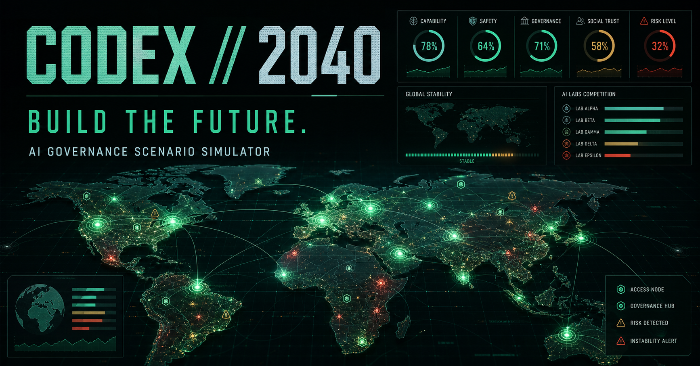
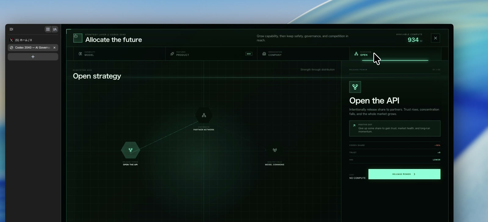
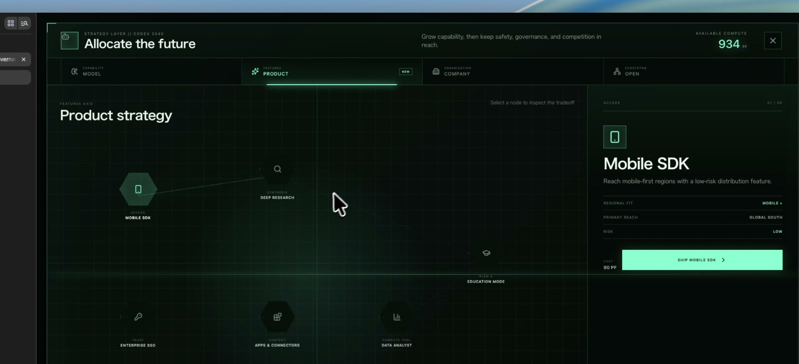
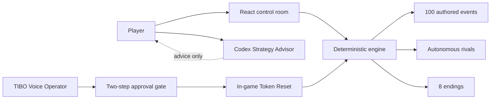
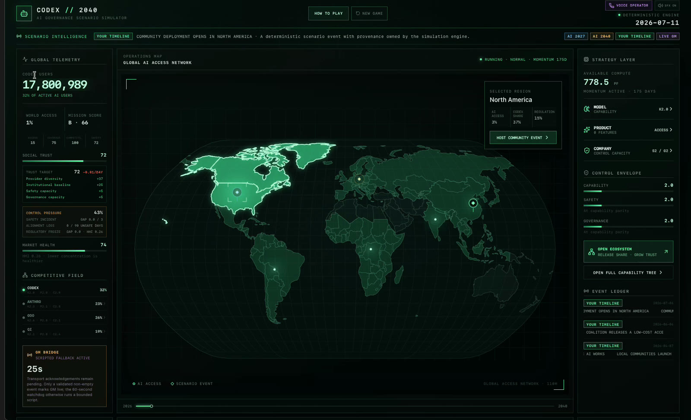

# Codex 2040

<p align="center">
  <strong>A playable AI-governance simulation where access, capability, safety, trust, and competition shape the future.</strong>
</p>

<p align="center">
  <a href="README.ja.md">日本語</a> ·
  <a href="https://codex-2040.kai-postv.chatgpt.site/">Play the latest English build</a> ·
  <a href="https://youtu.be/G1lsFJ5DhCE">Watch the demo</a> ·
  <a href="https://devpost.com/software/codex-2040-td74xu">Devpost project</a>
</p>

> 🥉 **3rd Place — OpenAI Build Week Tokyo community event (2026).** This local Tokyo recognition is separate from the global Devpost competition. [Event page](https://luma.com/9ksxm746)

[](https://codex-2040.kai-postv.chatgpt.site/)

| Timeline | World | Strategy | Pressure | Outcomes |
| --- | --- | --- | --- | --- |
| **2026 → 2040** | **8 regions** | **50 nodes** | **100 events** | **8 endings** |

You run Codex from 2026 to 2040. Expanding useful AI access is necessary, but it is not enough: capability can outrun safety, regulation can freeze deployment, rivals keep moving while you wait, and a monopoly can turn apparent success into failure.

> You did not own the world. You helped it learn.

## See the tradeoffs

<p align="center">
  
  
</p>

<p align="center"><sub>Selected frames from the supplied Build Week recordings. The hosted build is the source of truth for the current interface.</sub></p>

The strategy surface makes prerequisites, costs, effects, and irreversible exclusions visible before a choice is made. The catalog contains **12 Model**, **16 Product**, **12 Company**, and **10 Open Ecosystem** nodes.

## The game loop

1. **Invest** limited Compute in capability, products, organizational control, or an open ecosystem.
2. **Advance time** at Normal or Fast speed while autonomous rivals invest and operating costs continue.
3. **Respond** to authored world events and pivotal 2029 / 2035 decisions; major events pause the clock.
4. **Review your timeline** through access, Trust, market health, safety, governance, and one of eight endings.

| Your move | Visible consequence | If neglected |
| --- | --- | --- |
| Grow capability | More powerful products and faster reach | Capability–Safety or Capability–Governance gaps can trigger incidents, Misalignment, or Regulatory Freeze |
| Expand regions and products | More people gain useful AI access; Momentum restarts | Compute drains and rivals can capture underserved regions |
| Open the ecosystem | Codex share falls while Trust and market health can improve | Concentration can end in Pyrrhic Monopoly |
| Strengthen safety and governance | Control pressure falls and resilience rises | You may lose tempo in the capability race |

The score weights coverage, beneficial access, healthy competition, and safety. Maximizing one number is deliberately not a winning strategy.

## What makes Codex 2040 different

### Deterministic simulation, readable causality

The seeded TypeScript engine owns every number, risk transition, and ending. It runs fixed one-day steps, autonomous competitor strategies, bounded invariants, autosave, and replayable outcomes. The event system contains 20 authored events in each of five categories—disaster, culture, policy, competition, and technology—with provenance, cooldowns, and feature combos.

### A read-only Codex Strategy Advisor

The game is designed to sit beside Codex: the browser runs the simulation while a dedicated Advisor Skill explains a choice, maps a natural-language intention to an available node, and returns control. The Advisor never clicks, injects an event, edits a save, or plays for the user.

### Approval-gated Realtime voice

**TIBO — Voice Operator** uses the official OpenAI Agents SDK, `RealtimeAgent`, `RealtimeSession`, `gpt-realtime-2.1`, WebRTC, and a two-call approval contract. It can perform exactly one bounded action: request and, after explicit spoken confirmation, execute one in-game TIBO Token Reset. It cannot modify an OpenAI account, billing, API limits, or permissions.



## Play it

The latest hosted build is available at **[codex-2040.kai-postv.chatgpt.site](https://codex-2040.kai-postv.chatgpt.site/)**. No account is required. The four-step tutorial explains the mission and loss conditions, and browser autosave preserves returning sessions.

The hosted build includes the complete deterministic game, strategy tree, autonomous rivals, world events, decisions, telemetry, and endings. Voice behavior differs by environment:

| Environment | Game | TIBO voice |
| --- | --- | --- |
| Hosted OpenAI Sites build | Full deterministic simulation | Clearly labelled scripted fallback |
| Local Vite server with `OPENAI_API_KEY` | Full deterministic simulation | Live Realtime WebRTC session with approval-gated tool |

The standard API key remains server-side and is never placed in the static client bundle.

## Run locally

Requirements: Node.js `^20.19.0` or `>=22.12.0`, plus npm.

```bash
npm ci
npm run dev
```

Open `http://127.0.0.1:5173`. To enable live Realtime voice, place `OPENAI_API_KEY` in the ignored `.env.local`; without it, the game automatically uses the scripted fallback.

Run the complete automated verification pipeline with:

```bash
npm run check
```

`npm run check` runs the Vitest suite, TypeScript checks, the Vite client build, and the Worker build. Browser E2E remains a separate release gate.

## Architecture

- `src/engine.ts` — fixed-step state transitions, action effects, incidents, invariants, scoring, and endings.
- `src/strategyNodes/` — the validated bilingual 50-node catalog, prerequisites, exclusions, costs, and effects.
- `src/worldEvents/` — the five-category event catalog, eligibility rules, combos, and deterministic scheduler.
- `src/rivalStrategy.ts` — autonomous competitor strategy and visible rival pressure.
- `src/components/` — world map, strategy tree, decisions, voice, event, and ending interfaces.
- `.agents/skills/codex-2040-advisor/` — the consultation-only Advisor contract.
- `server/realtimePlugin.js` and `src/voiceAgent.ts` — short-lived Realtime client secrets and the browser voice session.
- `worker/`, `server/runsApi.ts`, and `db/` — hosted runtime, run telemetry, and D1 persistence.

The earlier GM file bridge remains in the repository as a dormant experiment and test reference. Normal gameplay does not start its heartbeat, polling loop, fallback deck, or action transport.

## Built with Codex and GPT-5.6

Codex was both the development surface and an engineering collaborator. It helped turn the learning thesis into a deterministic state machine, split research and implementation into parallel lanes, build the React control room and voice flow, generate adversarial replay and balance tests, localize the experience, and audit public claims against source and browser evidence.

GPT-5.6 was used throughout the core build—not only for brainstorming—to reason across the specification, engine, UI, tests, playtest evidence, and documentation.

## Educational grounding

Each scenario item carries explicit provenance:

- **AI 2027** — adapted capability, race, and slowdown dynamics.
- **AI 2040** — adapted governance and coordination ideas from Plan A.
- **Your Timeline** — consequences generated by the player's own choices.

Codex 2040 is an independent educational adaptation inspired by [AI 2027](https://ai-2027.com/) and [AI 2040: Plan A](https://ai-2040.com/) from the AI Futures Project. It simplifies and recombines ideas for learning, does not present either scenario as a prediction, and is not affiliated with or endorsed by the scenario authors.

## Limitations

- The hosted static build uses scripted voice fallback unless an equivalent trusted Realtime backend is available.
- Browser E2E, real-microphone rehearsal, and exact public-origin checks are release checks separate from unit/build success.
- The simulation is an educational simplification, not a forecast or policy recommendation.

## Earlier Build Week capture

[](docs/assets/codex-2040-demo.mp4)

**[▶ Watch the original 12-second prototype capture](docs/assets/codex-2040-demo.mp4)** or **[watch the current narrated demo on YouTube](https://youtu.be/G1lsFJ5DhCE)**.
